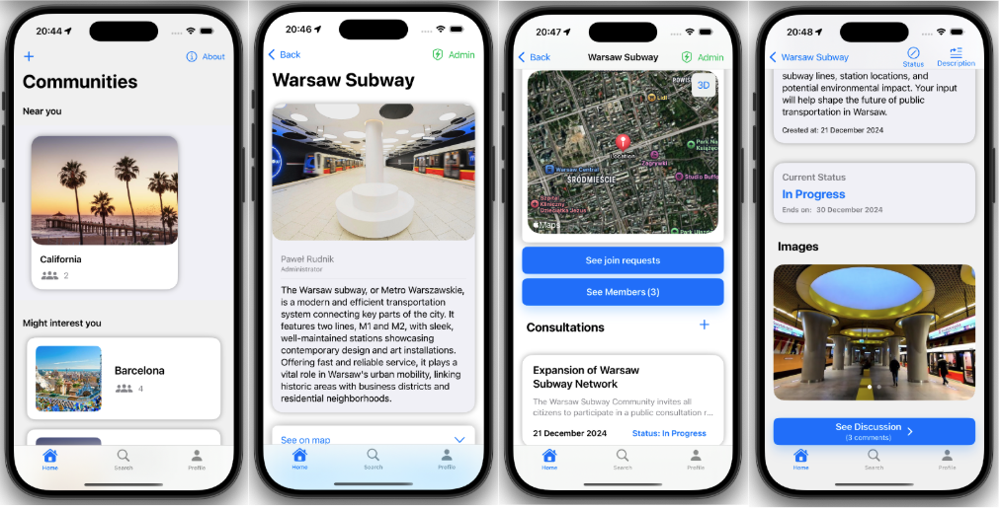
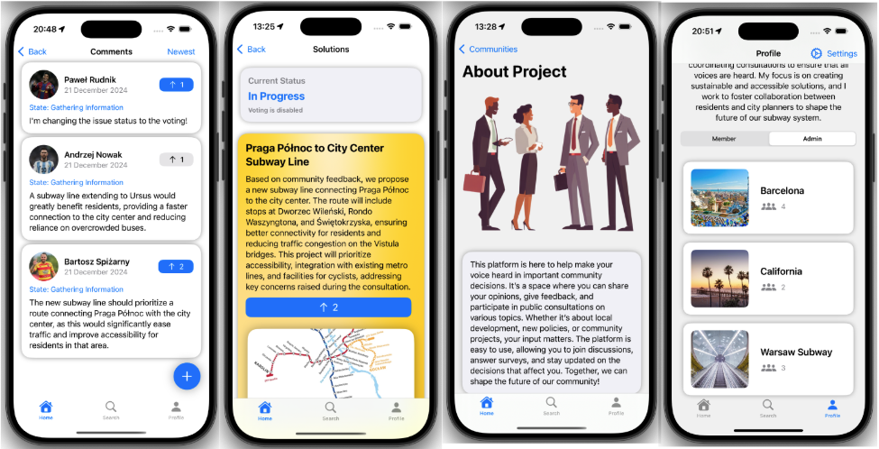

# Social Consultations Platform - iOS App

This repository contains the mobile implementation of a web platform and mobile application designed to facilitate and manage public consultations. The platform aims to provide an intuitive, efficient, and accessible way for users to participate in social consultations, collect feedback, and support decision-making processes.

## Table of Contents

1. [Project Overview](#project-overview)
2. [Features](#features)
3. [Tech Stack and Architecture](#tech-stack-and-architecture)
4. [Testing](#testing)
5. [Gallery](#gallery)
6. [Setup and Installation](#setup-and-installation)
7. [License](#license)

## Project Overview

The Social Consultations Platform is a collaborative project developed by a team of three, with each member responsible for a specific component:

- **Backend:** Developed by [Piotr Mazur](https://github.com/sirmazur), responsible for server-side logic, API creation, database management, and deployment on Azure.
- **Frontend:** Developed by [Bartosz Spiżarny](https://github.com/Bartolomeo26), responsible for the web interface using React.
- **Mobile App:** Developed by [Paweł Rudnik](https://github.com/pabl014), responsible for the iOS application using SwiftUI.

This repository focuses on the mobile component, which is built using SwiftUI and provides users with a seamless and intuitive interface to interact with the platform. It connects with the backend APIs to manage user authentication, participate in social consultations, submit feedback, and access consultation-related data. The app is designed to allow users to easily browse available consultations, track their progress, and engage in real-time interactions.

## Features

- **User Authentication:** Login and registration for users.
- **Social Consultations:** Browse, participate in, manage and create consultations.
- **Feedback Collection:** Users can submit feedback and participate in surveys related to consultations.
- **Profile Customization:** Users can edit their profiles to showcase their information, making it easier to connect and engage with others in the community.

## Tech Stack and Architecture

### Tools & Frameworks

- **SwiftUI** – Used for building the user interface of the iOS app, providing a declarative syntax for designing the app’s UI.
- **Photos UI** – Utilized for integrating the Photos framework, enabling users to select and display images in the app.
- **Core Location** – Used for obtaining the user's location and providing location-based features.
- **MapKit** – Integrated to display maps and handle geographic data within the app.
- **UniformTypeIdentifiers** – Used to handle file types and manage file-related tasks, such as uploading or viewing documents in the app.

### Architecture & Techniques

- **MVVM (Model-View-ViewModel)** – Applied to separate concerns, improve code maintainability, and manage the flow of data between the UI and the app’s business logic.
- **Async/Await** – Used for handling asynchronous code in a cleaner and more readable way, especially for network requests and data fetching.
- **Paging** – Implemented to efficiently load large sets of data (such as consultations or feedback) in chunks, improving performance.

## Testing

- **Unit Testing:** Conducted tests to ensure the correct functionality of user login and registration methods. Verified proper handling of ISO 8601 date conversions to and from `String`. Key areas tested include:
      - **Login:** Ensured no errors occur with valid input, and verified appropriate error messages for missing or invalid email/password combinations.
      - **Registration:** Validated input fields for correct email format, name length, password requirements, and password confirmation.
      - **Date Operations:** Tested ISO 8601 date-to-`Date` and `Date`-to-ISO 8601 string conversions, as well as formatting dates for display.

## Gallery





## Setup and Installation

To set up this project locally:

1. Clone the repository:

    ```bash
    git clone https://github.com/pabl014/SocialConsultations-SwiftUI.git
    ```

2. Open the project in Xcode.

3. Create Secrets.swift file.

```swift
import Foundation

struct Secrets {
    
    // MARK: - URLs
    static let baseURL: String = "your base url here"
    
    // MARK: - User
    static let usersURL: String = "\(baseURL)/api/users"
    static let authenticationURL: String = "\(baseURL)/api/authentication"
    static let selfURL: String = "\(baseURL)/api/users/self"
    static let resetPasswordURL: String = "\(baseURL)/api/users/getpassword"
    
    // MARK: - Community
    static let communitiesURL: String = "\(baseURL)/api/communities"
    static let closestURL: String = "\(baseURL)/closest/20"
    
    // MARK: - Issue
    static let issuesURL: String = "\(baseURL)/api/issues"
    
    // MARK: - Solutions
    static let solutionsURL: String = "\(baseURL)/api/solutions"
    
    // MARK: - Comments
    static let commentsURL: String = "\(baseURL)/api/comments"
}
```

4. Build and run the app on a simulator or device.

## License

This project is licensed under the MIT License - see the [LICENSE](LICENSE) file for details.
